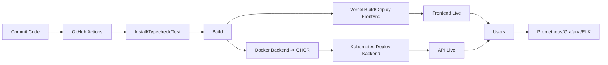

# Rosistat - DevOps Guide

## 1) Arborescence Repository
```
/frontend            # Vercel-ready (app actuelle)
/backend             # API Node/Express + SQLite
/database            # Migrations & seeds SQLite
/infrastructure
  ├─ k8s             # Manifests Kubernetes
  └─ terraform       # Terraform (provider K8s, namespace)
/ci-cd/github-actions# Workflows GitHub Actions
/monitoring-logging  # Plan observabilité
/docs                # Docs DevOps (ce fichier)
```

## 2) Base de Données (SQLite)
- Tables: `users`, `simulations`
- Migrations: `database/migrations/001_init.sql`
- Seeds: `database/seed/001_seed.sql`

Commande (PowerShell) pour préparer:
```powershell
sqlite3 .\database\rosistrat.db ".read .\database\migrations\001_init.sql"
sqlite3 .\database\rosistrat.db ".read .\database\seed\001_seed.sql"
```

## 3) Backend (Node/Express + SQLite)
- Entrée: `backend/src/index.ts`
- Connexion DB: `backend/src/db.ts`
- Endpoints: `/api/health`, `/api/users/:uid`, `/api/simulations`

Développement local:
```powershell
cd backend
npm ci
npm run dev
```

## 4) Frontend (Vercel)
- `vercel.json` inclut routes SPA.
- Déploiement via GitHub Actions (Vercel CLI) avec secrets `VERCEL_*`.

## 5) Containerisation & Compose
- Backend: `backend/Dockerfile`
- Frontend (dev): `frontend.Dockerfile`
- Local stack:
```powershell
docker compose up --build
```

## 6) Kubernetes (optionnel backend)
- Manifests: `infrastructure/k8s/*.yaml`
- Déploiement basique:
```powershell
kubectl apply -f infrastructure/k8s/sqlite-pvc.yaml
kubectl apply -f infrastructure/k8s/backend-deployment.yaml
```

## 7) Terraform (exemple)
- Provider Kubernetes + namespace: `infrastructure/terraform/main.tf`
- Initialisation:
```powershell
cd infrastructure/terraform
terraform init
terraform apply -var "kubeconfig=$env:USERPROFILE\.kube\config"
```

## 8) CI/CD (GitHub Actions)
- Workflow: `ci-cd/github-actions/ci.yml`
- Jobs:
  - build-test (Node 20): install, typecheck, test
  - docker-backend: build & push GHCR
  - vercel-deploy: build & deploy frontend

## 9) Monitoring & Logging
- Voir `monitoring-logging/README.md`
- Ajouter `/metrics` et logs JSON sur le backend pour intégration Prometheus/ELK.

## 10) Pipeline complet


## 11) Secrets & Config
- GitHub Secrets: `VERCEL_TOKEN`, `VERCEL_ORG_ID`, `VERCEL_PROJECT_ID`
- Backend env: `PORT`, `DB_FILE`
- K8s: Secrets pour endpoints externes (si nécessaires)

## 12) Commandes Utiles (PowerShell)
- Lancer dev local (Docker):
```powershell
docker compose up --build
```
- Appliquer migrations/seeds:
```powershell
sqlite3 .\database\rosistrat.db ".read .\database\migrations\001_init.sql"
sqlite3 .\database\rosistrat.db ".read .\database\seed\001_seed.sql"
```
- Déployer K8s:
```powershell
kubectl apply -f .\infrastructure\k8s\
```

---
Ce guide vous permet de présenter Rosistat comme un projet prêt pour DevOps (CI/CD, conteneurisation, IaC, observabilité) et de l’exécuter rapidement en local ou sur le cloud.
